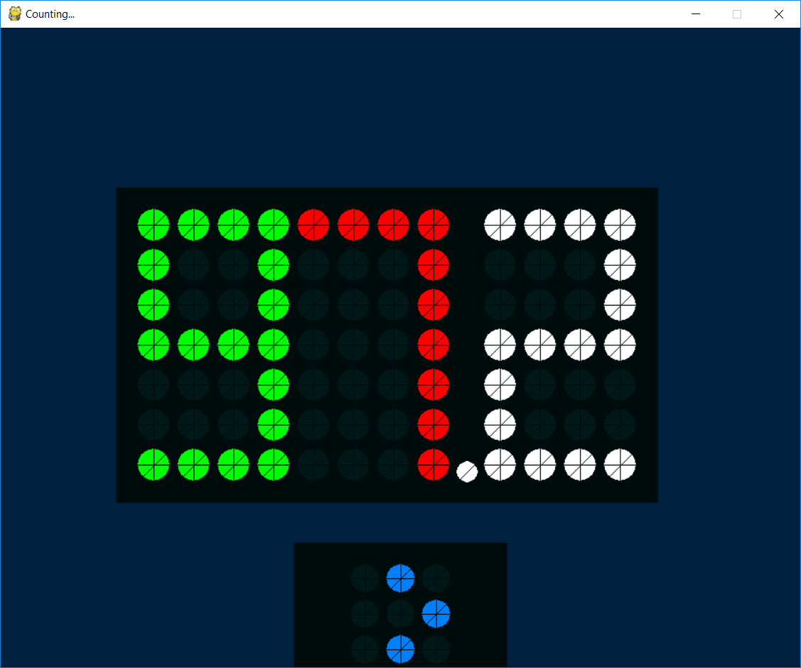

# PyDots

  Python recreation of a flip dot display with smooth transitions and a realistic look.
  Built on Python 3.x using PyGame.
  DavidG - Italy - April 2019

  Elements (as of first release):
    - Digit (4 * 7)
    - Sign (3 * 3)
    - Point
    
    

